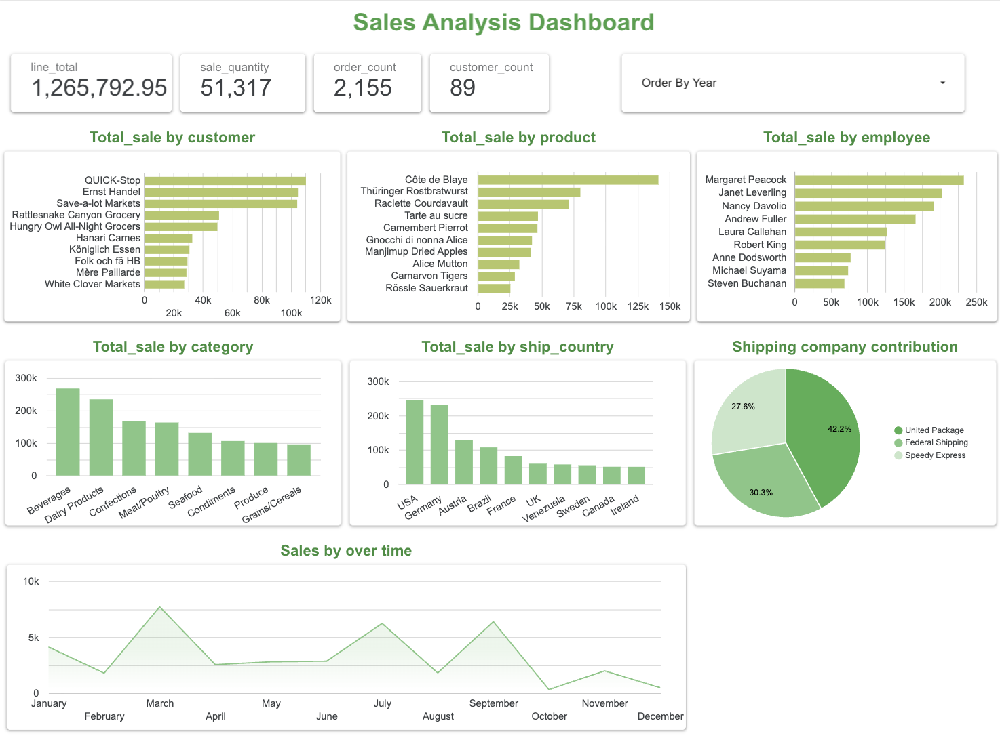

# Data Analytics Dashboard

## Overview

This project demonstrates an interactive data analytics dashboard built using PostgreSQL and Google Looker Studio. It showcases data extraction, transformation, visualization, and reporting to support data-driven decision-making.

---

## Project Objectives

- Analyze business data using SQL
- Create interactive dashboards
- Visualize KPIs
- Demonstrate database connectivity
- Practice real-world data analytics workflows

---

## Tools & Technologies

- PostgreSQL
- SQL
- Google Looker Studio
- Microsoft Excel

---

## Skills Demonstrated

- SQL Queries
- Data Cleaning
- Data Analysis
- Dashboard Development
- Data Visualization
- Reporting

---

## Dashboard Preview

---

## Dashboard Link

https://datastudio.google.com/reporting/561bfc0a-c623-438c-8f44-fc85aa63833a

---

## Repository Contents

- Dashboard Screenshot
- README Documentation

More files, including SQL scripts, datasets, and project documentation, will be added as the project continues to develop.

---

## Future Improvements

- Add Python automation
- Build ETL pipeline
- Add predictive analytics
